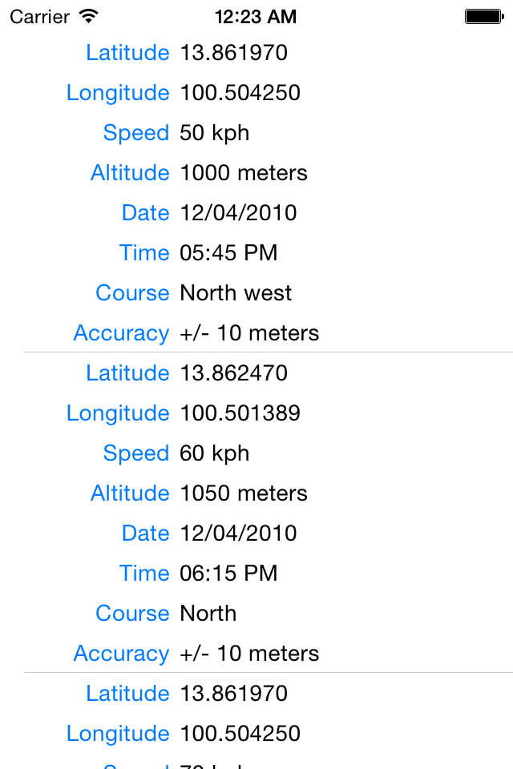
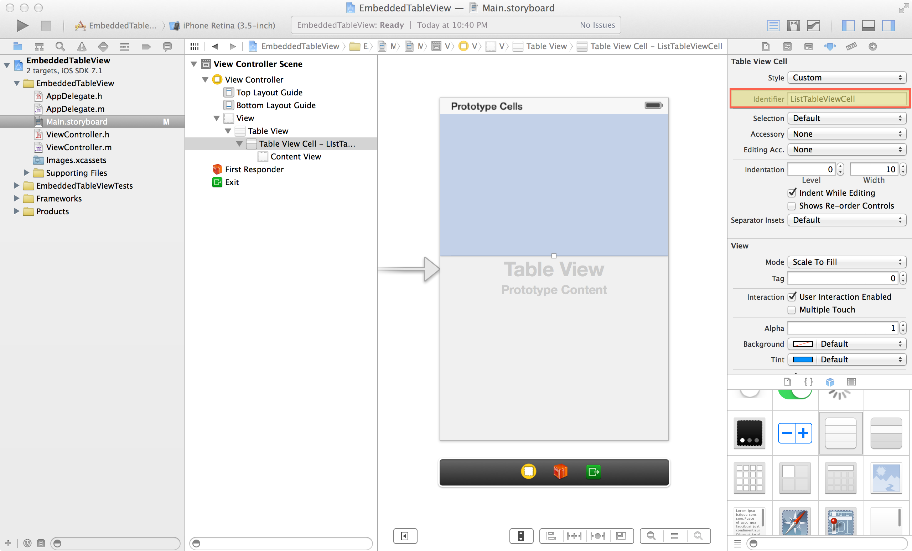
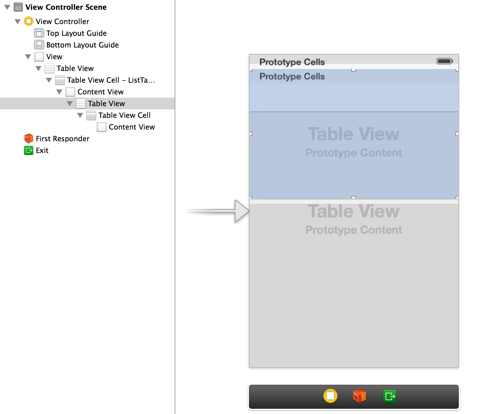
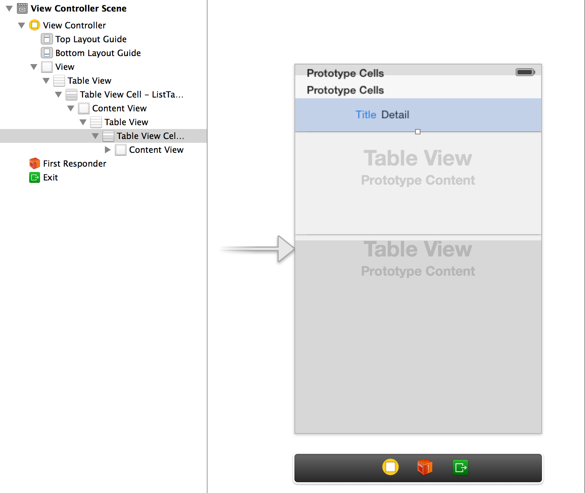
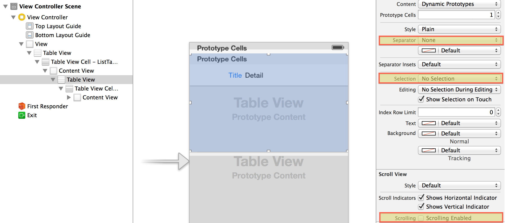
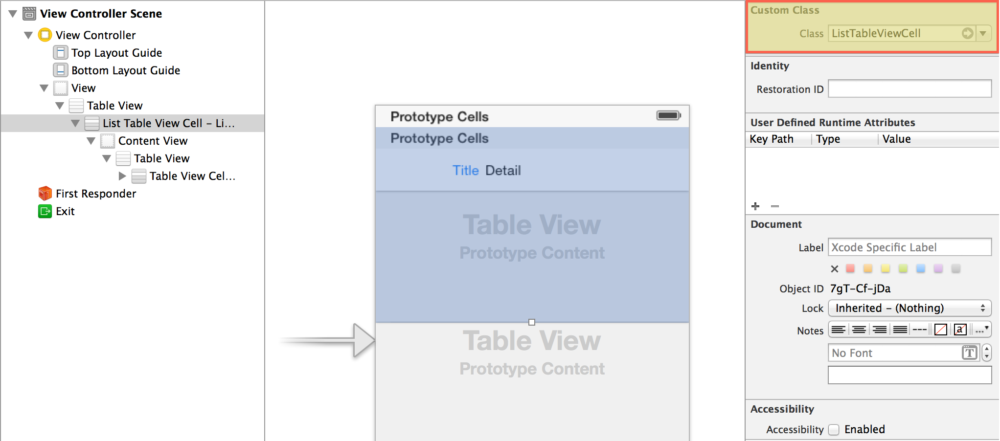
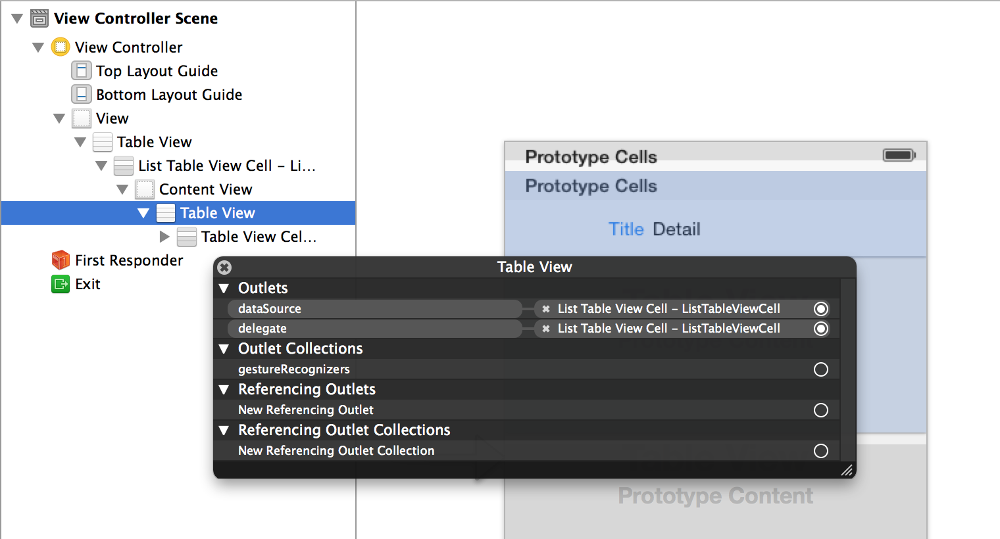

EmbeddedTableView
=================

An example to create embedded TableView in TableViewCell

Screenshot
----------



Reference document: [Adding a UITableView as a subview of UITableViewCell using Interface Builder](http://iosstuff.wordpress.com/2011/06/29/adding-a-uitableview-inside-a-uitableviewcell/)

System Requirement
------------------

* Xcode 5
* Objective-C

Preparation
-----------

* Create a single view application, named 'EmbeddedTableView'
* Drag a TableView (1) into default ViewController
* Drag a TableViewCell (1) into TableView



* Set TableViewCell (1)'s identifier as 'ListTableViewCell'
* Set TableView (1)'s row height to 200 (default value: 44)
* Drag a TableView (2) into TableViewCell (1)
* Drag a TableViewCell (2) into TableView (2)



* Set TableViewCell (2)'s identifier as 'InfoTableViewCell'
* Set TableViewCell (2)'s style as 'Left Detail'



* Set TableView (2)'s separator as 'None'
* Set TableView (2)'s selection as 'No Selection'
* Unset TableView (2)'s 'Scrolling Enable'



Making a custom UITableViewCell
-------------------------------

* Create a class ```ListTableViewCell```, subclass of ```UITableViewCell``` (1)
* Change TableViewCell (1), whose identifier is 'ListTableViewCell', to custom class ```ListTableViewCell```



* Right click TableView (2)
* Set TableView (2)'s ```dataSource``` to ```ListTableViewCell```
* Set TableView (2)'s ```delegate``` to ```ListTableViewCell```



* Add a property 'info' with type ```NSDictionary``` in ```ListTableViewCell.h```
* Implement UITableView ```delegate``` and ```dataSource``` in ```ListTableViewCell.m```

```Objective-C
#pragma mark - Table view delegate

- (CGFloat)tableView:(UITableView *)tableView heightForRowAtIndexPath:(NSIndexPath *)indexPath
{
    return 25;
}

#pragma mark - Table view data source

- (NSInteger)numberOfSectionsInTableView:(UITableView *)tableView
{
    // Return the number of sections.
    return 1;
}

- (NSInteger)tableView:(UITableView *)tableView numberOfRowsInSection:(NSInteger)section
{
    // Return the number of rows in the section.
    return [self.info count];
}

- (UITableViewCell *)tableView:(UITableView *)tableView cellForRowAtIndexPath:(NSIndexPath *)indexPath
{
    UITableViewCell *cell = [tableView dequeueReusableCellWithIdentifier:@"InfoTableViewCell" forIndexPath:indexPath];

    // Configure the cell...
    switch (indexPath.row) {
        case 0:
            cell.textLabel.text = @"Latitude";
            cell.detailTextLabel.text = [self.info objectForKey:@"Latitude"];
            break;

        case 1:
            cell.textLabel.text = @"Longitude";
            cell.detailTextLabel.text = [self.info objectForKey:@"Longitude"];
            break;

        case 2:
            cell.textLabel.text = @"Speed";
            cell.detailTextLabel.text = [self.info objectForKey:@"Speed"];
            break;

        case 3:
            cell.textLabel.text = @"Altitude";
            cell.detailTextLabel.text = [self.info objectForKey:@"Altitude"];
            break;

        case 4:
            cell.textLabel.text = @"Date";
            cell.detailTextLabel.text = [self.info objectForKey:@"Date"];
            break;

        case 5:
            cell.textLabel.text = @"Time";
            cell.detailTextLabel.text = [self.info objectForKey:@"Time"];
            break;

        case 6:
            cell.textLabel.text = @"Course";
            cell.detailTextLabel.text = [self.info objectForKey:@"Course"];
            break;

        case 7:
            cell.textLabel.text = @"Accuracy";
            cell.detailTextLabel.text = [self.info objectForKey:@"Accuracy"];
            break;
            
        default:
            break;
    }
    
    return cell;
}
```

* Create an outlet of TableView (1) to default ViewController, named 'listTableView'
* Add a property 'listDataArray' with type ```NSArray``` in ```ViewController.m```

```Objective-C
- (NSArray *)listDataArray
{
    if (!_listDataArray) {
        NSDictionary *one = [[NSDictionary alloc] initWithObjectsAndKeys:
                @"13.861970", @"Latitude",
                @"100.504250", @"Longitude",
                @"50 kph", @"Speed",
                @"1000 meters", @"Altitude",
                @"12/04/2010", @"Date",
                @"05:45 PM", @"Time",
                @"North west", @"Course",
                @"+/- 10 meters", @"Accuracy", nil];
        NSDictionary *two = [[NSDictionary alloc] initWithObjectsAndKeys:
                @"13.862470", @"Latitude",
                @"100.501389", @"Longitude",
                @"60 kph", @"Speed",
                @"1050 meters", @"Altitude",
                @"12/04/2010", @"Date",
                @"06:15 PM", @"Time",
                @"North", @"Course",
                @"+/- 10 meters", @"Accuracy", nil];
        NSDictionary *three = [[NSDictionary alloc] initWithObjectsAndKeys:
                @"13.861970", @"Latitude",
                @"100.504250", @"Longitude",
                @"70 kph", @"Speed",
                @"1000 meters", @"Altitude",
                @"12/04/2010", @"Date",
                @"06:35 PM", @"Time",
                @"South", @"Course",
                @"+/- 10 meters", @"Accuracy", nil];
        NSDictionary *four = [[NSDictionary alloc] initWithObjectsAndKeys:
                @"13.861970", @"Latitude",
                @"100.504250", @"Longitude",
                @"50 kph", @"Speed",
                @"1050 meters", @"Altitude",
                @"12/04/2010", @"Date",
                @"06:55 PM", @"Time",
                @"South West", @"Course",
                @"+/- 10 meters", @"Accuracy", nil];

        _listDataArray = [[NSArray alloc] initWithObjects:one, two, three, four, nil];
    }
    return _listDataArray;
}
```

* Implement UITableView ```delegate``` and ```dataSource``` in ```ViewController.m```

```Objective-C
#pragma mark - Table view delegate

- (CGFloat)tableView:(UITableView *)tableView heightForRowAtIndexPath:(NSIndexPath *)indexPath
{
    return 200;
}

#pragma mark - Table view data source

- (NSInteger)numberOfSectionsInTableView:(UITableView *)tableView
{
    // Return the number of sections.
    return 1;
}

- (NSInteger)tableView:(UITableView *)tableView numberOfRowsInSection:(NSInteger)section
{
    // Return the number of rows in the section.
    return [self.listDataArray count];
}

- (UITableViewCell *)tableView:(UITableView *)tableView cellForRowAtIndexPath:(NSIndexPath *)indexPath{
    UITableViewCell *cell = [tableView dequeueReusableCellWithIdentifier:@"ListTableViewCell" forIndexPath:indexPath];

    if ([cell isKindOfClass:[ListTableViewCell class]]) {
        ListTableViewCell *listCell = (ListTableViewCell *)cell;
        listCell.info = [self.listDataArray objectAtIndex:indexPath.row];
    }

    return cell;
}
```

* Set listTableView's ```delegate``` and ```dataSource``` to ViewController's ```viewDidLoad()```

```Objective-C
self.listTableView.delegate = self;
self.listTableView.dataSource = self;
```
